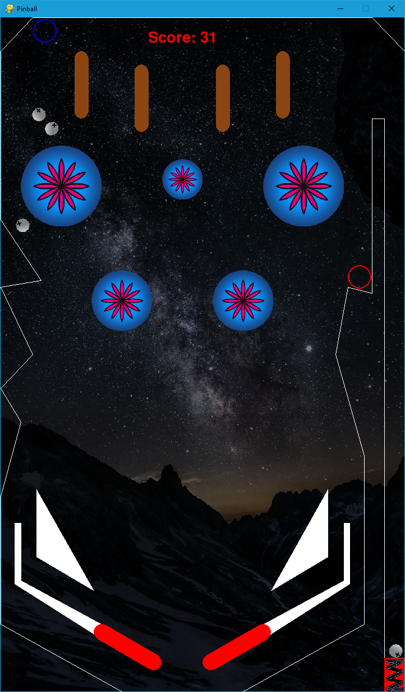

# Pinball

Physically-based Simulation in Computer Graphics (2021@ETH Zurich) student project

## Setup   
Setup conda environment: `conda env create -f pinball.yaml -n pinball`   
Activate environment: `conda activate pinball`

## How to play
Run the python file `pinball_pg.py` with the following command `python pinball_pg.py`.   

Keyboard Inputs:   
1. `A`: Left Flipper
2. `D`: Right Flipper
3. `K`: Shooter
4. `R`: Restart
5. `ESC`: Exit

## Current Layout

