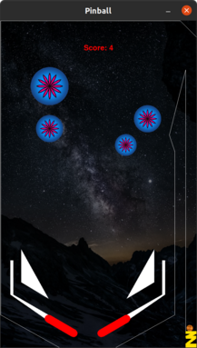

# Pinball

Physically-based Simulation in Computer Graphics (2021@ETH Zurich) student project

## Setup   
Setup conda environment: `conda env create -f pinball.yaml -n pinball`   
Activate environment: `conda activate pinball`

## Current Layout

